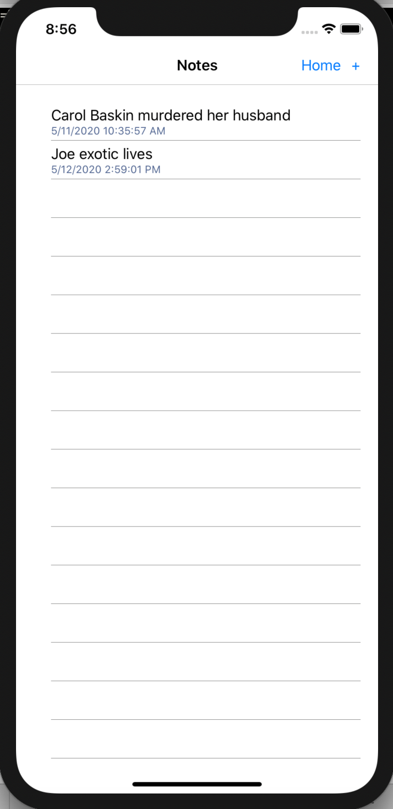
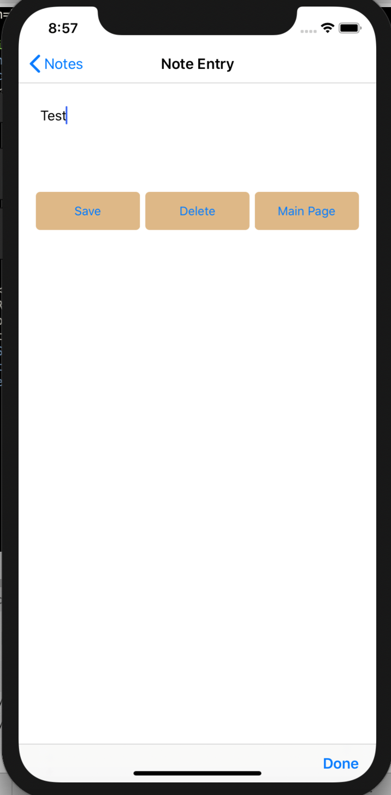

# TigerKing

## Description
TigerKing is a fan-made app for Netflix's Tiger King that aims to connect fans of the show to each other and the wider community (and demonstrate the results of our first exploration of Xamarin). Fans can write notes about the show.

Authors: Carrington Beard, Brandon Johnson, and Andrew Casper

[Code used from this Xamarin tutorial](https://docs.microsoft.com/en-us/xamarin/get-started/quickstarts/multi-page?pivots=windows)

(Note: views expressed in this app do not necessarily reflect the views of the authors. It's very possible Carol's husband was killed by a drug cartel in Puerto Rico.)

---

### Getting Started
Clone this repository to your local machine.

```
$ git clone https://github.com/Carringtonb/TigerKing.git
```

### To run the program from Visual Studio:
Select ```File``` -> ```Open``` -> ```Project/Solution```

Next navigate to the location you cloned the Repository.

Double click on the ```TigerKingApp``` directory.

Then select and open ```TigerKingApp.sln```

Windows: to debug on an emulated Android device, you will need to enable Hyper-V (Windows Pro+ only) or install HAXM

Mac: to debug on an emulated iOS device, select the option in the device emulator

---

### Visuals

#### Home Page

#### Notes Page

#### Note Entry Page


---

### Change Log
- 0.7 - Home page added, page routing updated, experimentation done with images and other media
- 0.3 - App created 5/11/2020


------------------------------
